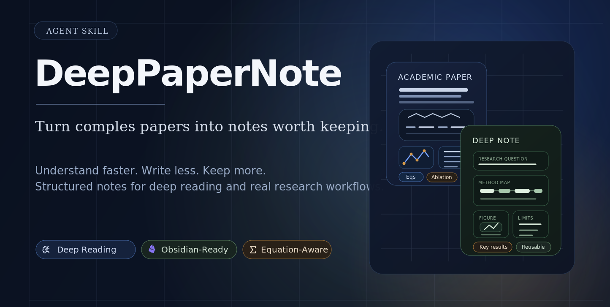

<div align="center">

# DeepPaperNote

**Turn one complex paper into an Obsidian note you will actually want to keep.**

[English](./README.md) | [简体中文](./README.zh-CN.md)

[](https://917dhj.github.io/DeepPaperNote/)
[](https://github.com/917Dhj/DeepPaperNote)
[](https://github.com/917Dhj/DeepPaperNote/releases)
[](./LICENSE)
[](./skills/deeppapernote/SKILL.md)
[](./skills/deeppapernote/references/obsidian-format.md)
[](./CHANGELOG.md)

</div>

[](https://917dhj.github.io/DeepPaperNote/)

<p align="center">
  <em>Read one paper deeply. Add one durable page to your academic wiki.</em>
</p>

**Do you know this situation? You sit down to study an important paper, but the exhausting part is not simply reading it. It is turning what you understood into a note you can still use later.** The time usually disappears into work like this:

- switching between the PDF, Zotero, web pages, and your note app
- manually organizing metadata, the abstract, figures, and the method backbone
- understanding part of the paper, then spending even longer turning that understanding into a coherent note
- ending up with something that looks complete but is not a note you actually want to revisit

DeepPaperNote takes over that repetitive, mechanical, and surprisingly expensive layer of paper reading. It gathers the material, builds the structure, places figures in context, and shapes the final note so you can keep your attention on the paper's real ideas.

In other words, you can think of DeepPaperNote as the **single-paper ingestion layer for an LLM-maintained academic wiki**: it reads one paper deeply and turns its research question, methods, evidence, results, and figures into a durable page that people can read and agents can reuse. Obsidian is where those pages live, connect, and grow; DeepPaperNote is how a paper reliably enters the wiki.

DeepPaperNote is an agent skill for reading **one paper at a time**. The same core skill runs in Claude Code and Codex, and it focuses on the questions that distinguish a deep-reading note from an abstract rewrite:

- What problem is the paper actually solving?
- How does the method, system, or analytical mechanism really work?
- Are the key formulas, experimental conclusions, and figure context preserved?
- Will the result become a useful long-term Obsidian note rather than a disposable summary?

> [!tip]
> If you already use Obsidian or Zotero, DeepPaperNote automates the most time-consuming and error-prone parts of evidence gathering, organization, and note production.

## 📰 News

- **[2026-07-16]** 🧩 Added [`paper-glossary`](./skills/paper-glossary/README.md), an optional companion skill for building reusable Obsidian terminology notes.
- **[2026-07-16]** 🔌 DeepPaperNote is now distributed as a plugin for multiple agents, with support for selecting multiple skills from the repository. [PR #12](https://github.com/917Dhj/DeepPaperNote/pull/12)
- **[v2.0.0]** 🚀 Released a deeper evidence-first paper-reading workflow with stronger note planning and figure handling. [Release notes](https://github.com/917Dhj/DeepPaperNote/releases/tag/v2.0.0)

News lists only the three most recent user-facing milestones. See the [changelog](./CHANGELOG.md) and [GitHub Releases](https://github.com/917Dhj/DeepPaperNote/releases) for the full history.

## 🚀 Quick Start

### 1. Install the plugin

```bash
npx skills add 917Dhj/DeepPaperNote
```

The installer lets you choose which skills to install and which agents should receive them. For most users, start with `deeppapernote`; add `paper-glossary` only if you want reusable terminology notes.

### 2. Install the core PDF dependency

```bash
python3 -m pip install PyMuPDF
```

DeepPaperNote requires Python 3.10 or newer. `PyMuPDF` powers the core PDF extraction path.

### 3. Hand a paper to your agent

A title, DOI, URL, arXiv ID, or local PDF all work. Zotero items are also supported when a compatible integration is available.

```text
Generate a deep-reading note for this paper: <title, DOI, URL, arXiv ID, or local PDF>
Turn this paper into an Obsidian note: <paper>
```

DeepPaperNote currently generates Chinese notes by default, and its writing and validation rules are optimized for Chinese output.

## 🎯 Why DeepPaperNote?


| You may be dealing with... | DeepPaperNote helps by... |
| --- | --- |
| 📄 **You finished the paper, but your notes are still a pile of fragments** | Rebuilding the research question, method chain, central experiments, and limitations into one note you can actually read again |
| 🧠 **You do not want another polished-looking AI summary** | Preserving the formulas, numbers, figure context, and evidence boundaries that make the paper worth understanding |
| 🗂️ **You keep reading papers, but they never become your academic wiki** | Turning each paper into a searchable, linkable, reusable Obsidian knowledge page so your academic wiki grows one paper at a time |
| 📚 **The paper is already in Zotero, and you do not want to match or download it again** | Preferring local records and attachments when available, reducing repeated work and paper mismatches |

## 🧩 Skills

DeepPaperNote remains the main product. The repository also includes an optional companion skill that works from DeepPaperNote's saved paper artifacts without taking over or rerunning the paper-reading workflow.

| Skill | Role | When to use it |
| --- | --- | --- |
| [`deeppapernote`](./skills/deeppapernote/SKILL.md) | **Core product · recommended** | Read one paper deeply and produce a structured, evidence-based Obsidian note with figures, results, and limitations |
| [`paper-glossary`](./skills/paper-glossary/SKILL.md) | Optional companion | Select terms from existing paper artifacts, create reusable Obsidian glossary notes, and optionally link them back to the paper note |

You do not need to install every skill. Choose the ones that match your workflow during installation.

## ✅ Quality Promise

- The result should be a deep-reading note for one paper, not an abstract rewrite.
- Important methods, experimental results, figures, and limitations should be explained rather than merely listed.
- If the available source is not strong enough for a real deep read, the workflow should stop and ask for better material instead of pretending the note is complete.

The canonical execution contract lives in [`skills/deeppapernote/SKILL.md`](./skills/deeppapernote/SKILL.md).

## 🗂️ Obsidian Setup

To make an Obsidian vault the default save target, set:

```bash
export DEEPPAPERNOTE_OBSIDIAN_VAULT="/absolute/path/to/your/vault"
```

- When a usable vault is configured or provided, DeepPaperNote saves the validated note and its paper-local `images/` directory there.
- When no vault is configured, DeepPaperNote asks first. It writes to the current workspace only after you explicitly choose not to use a vault.
- If a configured vault save fails, DeepPaperNote reports the blocked save instead of silently switching to another destination.

## 🔧 Optional Enhancements

None of these are required for ordinary digital PDFs.

| Enhancement | What it helps with |
| --- | --- |
| Zotero integration | Reuses local paper records and PDF attachments before searching online |
| Semantic Scholar API | Improves metadata lookup for papers that are difficult to resolve |
| OCR tooling | Recovers page text from scanned or low-quality PDFs |

When one of these capabilities is needed, ask your agent to inspect the current environment and guide the setup for that machine.

## 🧭 Inspirations

DeepPaperNote was influenced by projects that take paper reading, evidence extraction, and note generation seriously, especially:

- [heleninsights-dot/phd-deepread-workflow](https://github.com/heleninsights-dot/phd-deepread-workflow)
- [juliye2025/evil-read-arxiv](https://github.com/juliye2025/evil-read-arxiv)

## 🤝 Contributing

Pull requests should target `develop`, not `main`. Changes that may affect final note quality should be evaluated with [`evals/regression-workflow.md`](./evals/regression-workflow.md) and [`evals/note-quality-rubric.md`](./evals/note-quality-rubric.md).

## Star History

<a href="https://www.star-history.com/?repos=917Dhj%2FDeepPaperNote&type=date&legend=top-left">
 <picture>
   <source media="(prefers-color-scheme: dark)" srcset="https://api.star-history.com/chart?repos=917Dhj/DeepPaperNote&type=date&theme=dark&legend=top-left&sealed_token=kAnUJ2TywAGCCM_w7PwP3YipfkfnbMAKoC4YyYEHTU9Zbsxeji8m-rQ7HcHg7QD8CYnAwUfgje405CPTfmKYBlPPCZZDRCz_bXekWyK-VERr1SGXzeOjgLCGiXCgTf1BAdnDn7oQ7b_-PC91F_DySCY4kkQ23MabDoKE6acumkRXDfz1u4NJlqP_Z1c6" />
   <source media="(prefers-color-scheme: light)" srcset="https://api.star-history.com/chart?repos=917Dhj/DeepPaperNote&type=date&legend=top-left&sealed_token=kAnUJ2TywAGCCM_w7PwP3YipfkfnbMAKoC4YyYEHTU9Zbsxeji8m-rQ7HcHg7QD8CYnAwUfgje405CPTfmKYBlPPCZZDRCz_bXekWyK-VERr1SGXzeOjgLCGiXCgTf1BAdnDn7oQ7b_-PC91F_DySCY4kkQ23MabDoKE6acumkRXDfz1u4NJlqP_Z1c6" />
   
 </picture>
</a>

<p align="center">
  <em>Thanks for reading, using, and supporting DeepPaperNote. May your paper-reading days be a little clearer, calmer, and more rewarding.</em>
</p>

<p align="center">
  <a href="./LICENSE">MIT License</a> &copy; <a href="https://github.com/917Dhj">917Dhj</a>
</p>
