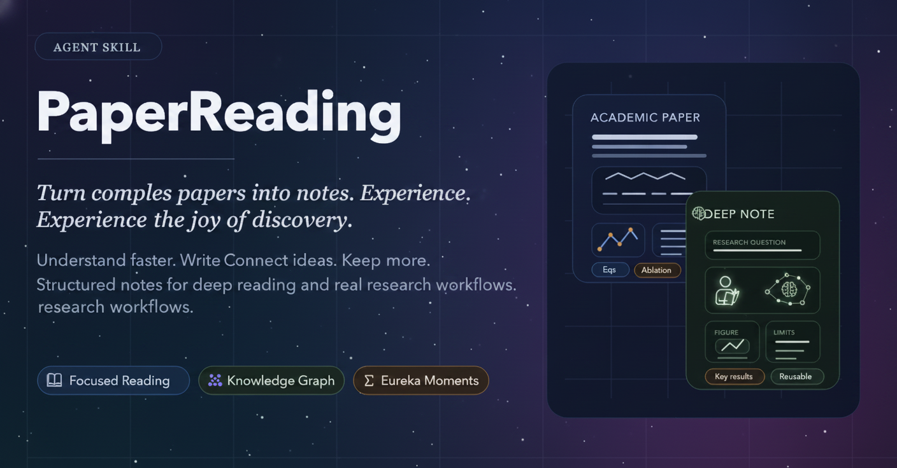

<div align="center">

# PaperReading

### 把一篇复杂论文，变成一篇真正值得长期保留的 Obsidian 笔记

<p>
  <a href="./README.md">简体中文</a> ·
  <a href="./README.en.md">English</a> ·
  <a href="https://huangqj23.github.io/PaperReading/">在线主页</a>
</p>

<p>
  <a href="https://huangqj23.github.io/PaperReading/"></a>
  <a href="https://github.com/huangqj23/PaperReading"></a>
  <a href="https://github.com/huangqj23/PaperReading/releases"></a>
  <a href="./LICENSE"></a>
  <a href="./skills/deeppapernote/SKILL.md"></a>
  <a href="./skills/deeppapernote/references/obsidian-format.md"></a>
</p>

</div>

<p align="center">
  <a href="https://huangqj23.github.io/PaperReading/">
    
  </a>
</p>

<p align="center">
  <strong>深读一篇论文，沉淀一页学术 Wiki。</strong><br>
  <sub>一次只处理一篇论文 · 默认生成中文笔记 · 面向 Obsidian 长期积累</sub>
</p>

<p align="center">
  <a href="#-快速开始">快速开始</a> ·
  <a href="#-为什么选择-paperreading">核心能力</a> ·
  <a href="#-skills">Skills</a> ·
  <a href="#-可选增强">可选增强</a> ·
  <a href="./CHANGELOG.md">更新日志</a>
</p>

---

PaperReading 是一个专注于**单篇论文深度阅读**的 Agent Skill。它接管材料收集、结构整理、图表定位和笔记成形，将研究问题、方法、证据、结果与局限沉淀为可搜索、可链接、可长期复用的 Obsidian 学术知识页。

<table>
  <tr>
    <td align="center" width="25%"><b>🔍 证据优先</b><br><sub>基于全文与原始章节写作，不止改写摘要</sub></td>
    <td align="center" width="25%"><b>🧠 深度分析</b><br><sub>解释方法机制、关键实验与结论边界</sub></td>
    <td align="center" width="25%"><b>🖼️ 图表保留</b><br><sub>让公式、表格与图片回到对应论证位置</sub></td>
    <td align="center" width="25%"><b>🗂️ 长期沉淀</b><br><sub>输出结构化 Obsidian 笔记与图片目录</sub></td>
  </tr>
</table>

> [!tip]
> 已有 Obsidian 或 Zotero 工作流？PaperReading 会优先复用现有材料，把最耗时、也最容易出错的取证、整理和成稿环节自动化。

## 📰 最新动态

- **[2026-07-18]** 📄 新增可选的 MinerU PDF 转 Markdown 能力，以及保留原文结构的中文翻译脚本。
- **[2026-07-16]** 🧩 新增可选 companion skill [`paper-glossary`](./skills/paper-glossary/README.md)，用于构建可复用的 Obsidian 术语笔记。
- **[2026-07-16]** 🔌 DeepPaperNote 现在以支持多个 Agent 的插件形式分发，并支持从仓库中选择多个 skill。[PR #12](https://github.com/917Dhj/DeepPaperNote/pull/12)

这里只保留最近三条用户可感知的重要动态。完整历史请查看 [CHANGELOG](./CHANGELOG.md) 与 [GitHub Releases](https://github.com/huangqj23/PaperReading/releases)。

## 🚀 快速开始

### 1. 安装插件

```bash
npx skills add huangqj23/PaperReading
```

安装程序会让你选择需要安装的 skill，以及要安装到哪些 Agent。大多数用户可以先选择 `deeppapernote`；只有需要可复用术语笔记时，再选择 `paper-glossary`。

### 2. 安装核心 PDF 依赖

```bash
python3 -m pip install PyMuPDF
```

DeepPaperNote 需要 Python 3.10 或更高版本。核心 PDF 抽取路径依赖 `PyMuPDF`。

### 3. 把论文交给 Agent

论文标题、DOI、URL、本地 PDF 都可以直接作为输入；也支持 arXiv ID，在具备兼容集成时还支持 Zotero 条目。

```text
给这篇论文生成深度笔记：<论文标题、DOI、URL、arXiv ID 或本地 PDF>
把这篇论文整理成 Obsidian 笔记：<论文>
```

DeepPaperNote 默认生成中文笔记，当前写作与校验规则也主要针对中文输出优化。

## 🎯 为什么选择 PaperReading？

<p align="center">
  
</p>

| 你可能正遇到…… | PaperReading 会帮你…… |
| --- | --- |
| 📄 **论文读完了，但笔记还是一堆散乱片段** | 把研究问题、方法链路、核心实验和局限重新组织成一篇真正能够再次读懂的笔记 |
| 🧠 **不想再收藏一篇“看起来很完整”的 AI 摘要** | 保留真正重要的公式、数字、图表语境和证据边界，让笔记承载真实理解 |
| 🗂️ **论文越读越多，却始终没有形成自己的学术 Wiki** | 把每篇论文沉淀为可搜索、可链接、可长期复用的 Obsidian 知识页面，让你的学术 Wiki 逐篇生长 |
| 📚 **Zotero 里已经有论文，不想重新下载和匹配** | 在可用时优先复用本地条目和附件，减少重复工作与论文错配 |

### 工作流概览

<p align="center">
  <code>确认论文</code> → <code>获取全文</code> → <code>抽取证据</code> → <code>规划图表</code> → <code>深度写作</code> → <code>校验保存</code>
</p>

## 🧩 Skills

`deeppapernote` 是核心产品。仓库同时提供可选 companion skill；它只使用已经保存的论文材料，不会接管或重新运行论文精读流程。

| Skill | 定位 | 什么时候使用 |
| --- | --- | --- |
| [`deeppapernote`](./skills/deeppapernote/SKILL.md) | **核心产品 · 推荐安装** | 精读单篇论文，生成包含图表、关键结果与局限的结构化、证据充分的 Obsidian 笔记 |
| [`paper-glossary`](./skills/paper-glossary/SKILL.md) | 可选 companion | 从已有论文材料中筛选术语，创建可复用的 Obsidian 术语笔记，并按需链接回论文笔记 |

你不需要一次安装所有 skill。安装时选择适合自己工作流的部分即可。

## ✅ 质量承诺

- 最终结果应该是一篇单篇论文深度笔记，而不是摘要改写。
- 重要的方法、实验结果、图表和局限应该得到解释，而不只是被罗列出来。
- 如果现有来源不足以支撑真正的深度精读，流程应该停止并要求更好的材料，而不是假装笔记已经完成。

规范执行契约以 [`skills/deeppapernote/SKILL.md`](./skills/deeppapernote/SKILL.md) 为准。

## 🗂️ Obsidian 配置

如果希望默认保存到 Obsidian 库，请设置：

```bash
export DEEPPAPERNOTE_OBSIDIAN_VAULT="/你的/Obsidian/库/绝对路径"
```

- 配置或提供了可用的 Vault 时，DeepPaperNote 会把校验完成的笔记及其论文专属 `images/` 目录保存到该 Vault。
- 没有配置 Vault 时，DeepPaperNote 会先询问；只有你明确选择不使用 Vault 后，才会写入当前 workspace。
- 如果已配置的 Vault 保存失败，DeepPaperNote 会报告保存受阻，而不会静默切换到其他目标。

## 🔧 可选增强

处理普通数字版 PDF 时，下面这些能力都不是必需项。

| 可选增强 | 能解决什么问题 |
| --- | --- |
| Zotero 集成 | 联网搜索前优先复用本地论文条目与 PDF 附件 |
| Semantic Scholar API | 改善部分难以识别论文的元数据获取 |
| MinerU API | 把可公开访问的 PDF URL 解析为包含公式、表格和图片的结构化 Markdown |
| OpenAI 兼容翻译 API | 在保留文档结构、公式、代码块、链接和图片的同时，将抽取结果翻译成中文 |
| OCR 工具 | 从扫描版或文本质量较差的 PDF 中恢复页面文字 |

实际需要其中某项能力时，可以让 Agent 检查当前环境，并针对这台机器引导配置。

<details>
<summary><strong>展开查看 MinerU 抽取与中文翻译配置</strong></summary>

### MinerU 抽取与中文翻译

这两个脚本均为可选能力，默认的 PyMuPDF 路径不依赖它们。使用前需安装 `requests`：

```bash
python3 -m pip install requests
```

使用 MinerU v4 API 抽取可远程访问的 PDF 时，先在 [MinerU API 管理页面](https://mineru.net/apiManage)创建令牌，然后运行：

```bash
export DEEPPAPERNOTE_MINERU_TOKEN="<你的-MinerU-令牌>"

python3 skills/deeppapernote/scripts/mineru_client.py \
  --pdf-url "https://example.org/paper.pdf" \
  --output-dir "./paper"
```

脚本会生成 `./paper/_mineru_full.md`，并把抽取出的图片保存到 `./paper/images/`。MinerU API 目前要求 PDF URL 可远程访问；只有本地 PDF 时请使用默认的 PyMuPDF 路径。

如需通过 OpenAI 兼容的 Chat Completions API 将抽取结果翻译成中文，可继续运行：

```bash
export DEEPPAPERNOTE_TRANSLATE_KEY="<你的-API-Key>"
export DEEPPAPERNOTE_TRANSLATE_BASE_URL="https://api.deepseek.com/v1" # 可选
export DEEPPAPERNOTE_TRANSLATE_MODEL="deepseek-v4-pro"                # 可选

python3 skills/deeppapernote/scripts/translate_markdown.py \
  --input "./paper/_mineru_full.md" \
  --output "./paper/_mineru_full.zh-CN.md"
```

翻译脚本会保留 Markdown 标题、公式、代码块、链接、图片引用和 HTML 表格。MinerU 抽取会把 PDF URL 发送给 MinerU，翻译则会把抽取文本发送给所配置的模型服务商；启用前请确认相关服务的隐私与计费政策。

</details>

## 🧭 致谢与灵感

DeepPaperNote 在工作流设计上受到了一些认真对待论文阅读、证据提取与笔记生成的项目启发，尤其是：

- [heleninsights-dot/phd-deepread-workflow](https://github.com/heleninsights-dot/phd-deepread-workflow)
- [juliye2025/evil-read-arxiv](https://github.com/juliye2025/evil-read-arxiv)

## 🤝 贡献说明

请将 Pull Request 提交到 `develop`，而不是 `main`。可能影响最终笔记质量的改动，应使用 [`evals/regression-workflow-zh.md`](./evals/regression-workflow-zh.md) 与 [`evals/note-quality-rubric.md`](./evals/note-quality-rubric.md) 进行评估。

## ⭐ Star History

<p align="center">
  <a href="https://www.star-history.com/?repos=huangqj23%2FPaperReading&type=date">
    
  </a>
</p>

<p align="center">
  <strong>感谢你阅读、使用和支持 PaperReading。</strong><br>
  <sub>愿你的每一次论文精读，都更清晰、更从容，也更有收获。</sub>
</p>

<p align="center">
  <a href="https://huangqj23.github.io/PaperReading/">主页</a> ·
  <a href="./CHANGELOG.md">更新日志</a> ·
  <a href="./LICENSE">MIT License</a>
</p>
